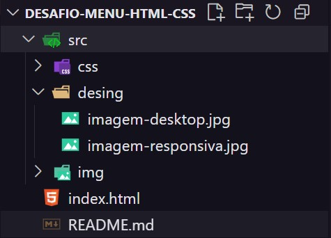
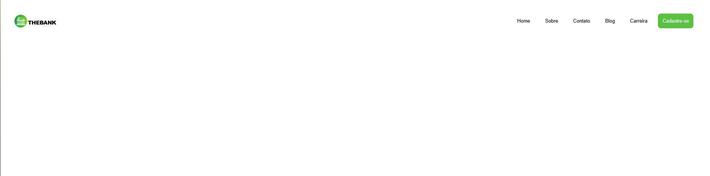
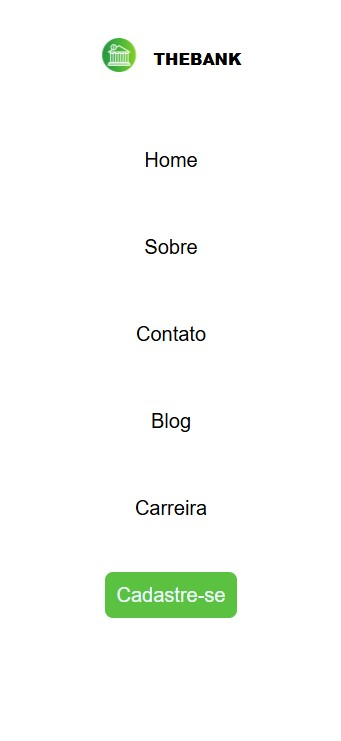

# 🏦 THEBANK

Um site institucional moderno e responsivo de um banco fictício, criado para fins de aprendizado e prática de HTML e CSS.

---

## 🛠️ Tecnologias Utilizadas

- **HTML5**
- **CSS3**
---

## 🎯 Objetivos do Projeto
- Praticar estruturação de componentes com HTML.
- Estilizar interfaces responsivas e centradas com CSS.
- Planejar futura integração com JavaScript
- Trabalhar tipografia e espaçamento para foco em leitura.

---

## 📂 Estrutura do Projeto

---
## 📸 Prévia do Projeto

---

## 📌 Funcionalidades

- Página inicial com logotipo e navegação clara
- Menu com links para:
  - Home
  - Sobre
  - Contato
  - Blog
  - Carreira
  - Cadastro
- Design limpo e profissional
- Paleta de cores elegante com destaque para o roxo e verde

---

## 📱 Responsividade

O site foi desenvolvido com foco em um layout responsivo, adaptando-se perfeitamente a diferentes tamanhos de tela.

- 📱 Mobile First
- 💻 Adaptação para tablets e desktops
- 🔁 Uso de **media queries** para ajustes dinâmicos
- 🔀 Reorganização de elementos em telas menores

---
## 📌 Status do Projeto
- ✔️ Finalizado como projeto de prática individual.

---

## 🙋‍♂️ Autor
- Feito com 💻 por Guilherme Henry
- 📍 Belo Horizonte
- 📧 guilherme.henrydesigner@gmail.com

